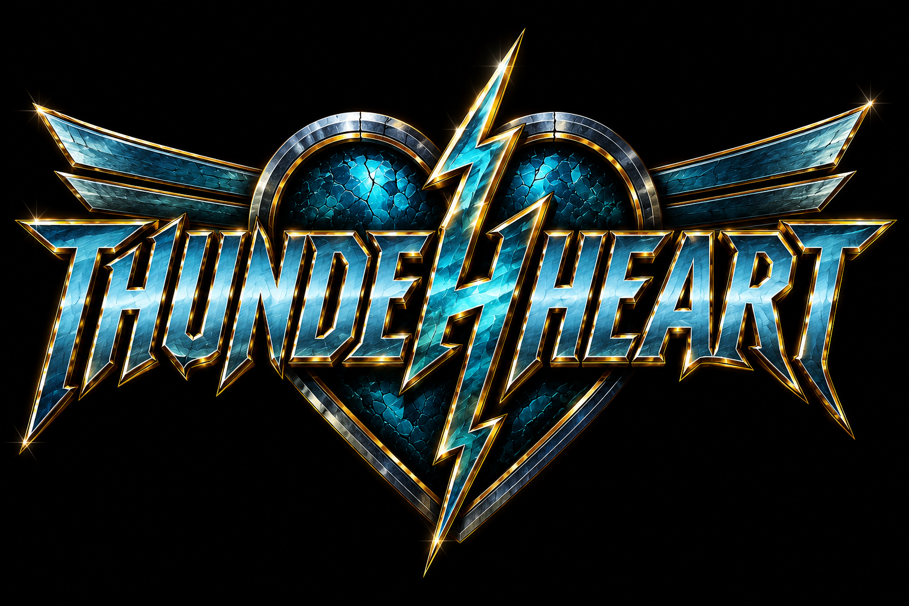

# Thunderheart Website — Improvement Report

Audited: `https://pstenbumling.github.io/thunderheart/` (live, GitHub Pages)
Method: fetched the deployed HTML/CSS/JS directly, measured real asset byte sizes and response headers via `curl`, and read the full DOM/script for accessibility and SEO gaps. All numbers below are measured, not estimated.

---

## Executive Summary

The site nails its visual identity: dark, glassmorphic cards, a charge-up lightning background, and a working custom audio player with a 3-track playlist and an animated "Legend" crawl. The core concept is strong and doesn't need to change.

Three things are working against it right now:

1. **Payload weight.** The page unconditionally loads **~4.2 MB of images** (a 1.79 MB logo PNG + five 384–612 KB background frames, all fetched eagerly via JS before the charge-up loop even starts) before a visitor can do anything. On a mobile connection this is a real first-paint problem.
2. **Accessibility gaps that make parts of the site unusable without a mouse.** The track-switching playlist is built from `<div>`s with only a `click` listener — no `tabindex`, no keyboard handler, no ARIA role. Keyboard and screen-reader users cannot change tracks. The `seek`/`volume` sliders have no accessible name. Most secondary text uses a blue (`#2a7ea3`) that measures **4.45:1 contrast** against the background — just under the 4.5:1 WCAG AA minimum for normal text.
3. **Zero SEO/metadata surface.** No `<meta name="description">`, no Open Graph tags, no favicon, no `<h1>` anywhere in the document, generic `<title>Thunderheart</title>`. The page is invisible to search/social previews and has no semantic heading structure.

None of this requires leaving the static single-file GitHub Pages model. Every fix below is plain HTML/CSS/JS.

---

## Detailed Findings

### Performance (measured via `curl` against the live site)

| Asset | Size | Notes |
|---|---|---|
| `assets/logo.png` | 1,787,760 bytes (1.79 MB) | Rendered at max 520px wide but served at full source resolution |
| `assets/frames/frame-1.png` … `frame-5.png` | 384–612 KB each, **2.45 MB total** | All 5 preloaded via JS `new Image()` immediately on page load, regardless of device/connection |
| `assets/the-last-stormkeeper.mp3` | 2.05 MB | Only `preload="metadata"` — good, not fetched in full upfront |
| `assets/stand-and-fight.mp3` | 1.92 MB | Same |
| `assets/northern-star.mp3` | 2.94 MB | Same |
| HTML document | 20 KB raw, **5.3 KB gzipped** (confirmed via `Content-Encoding: gzip`) | Fine |

**Critical-path weight before interaction ≈ 4.2 MB** (logo + all 5 frames), on top of the HTML. PNGs don't benefit from gzip (already binary-compressed), so the only lever is re-encoding/resizing.

`Cache-Control: max-age=600` is applied uniformly by GitHub Pages to every file, including the large binaries — there's no way to set a longer `max-age` for immutable assets on GitHub Pages (no custom headers support), so returning visitors re-validate every 10 minutes rather than reading from a long-lived cache.

### Accessibility

- **Playlist is mouse-only.** `.playlist-item` elements are `<div>`s with a `click` listener and nothing else — not focusable, no `role="button"`/`role="option"`, no Enter/Space handling. A keyboard-only or screen-reader user cannot switch tracks at all.
- **Sliders have no accessible name.** `#seek` and `#volume` are bare `<input type="range">` with no `<label>`, `aria-label`, or `aria-valuetext`. A screen reader announces "slider" with no context.
- **Contrast failure.** `--blue-dim: #2a7ea3` on `--bg: #050608` computes to a **4.45:1** contrast ratio (WCAG relative-luminance formula). WCAG AA requires 4.5:1 for normal-size text. This color is used for `.track-sub`, `.legend-label`, inactive `.playlist-item`, and `.time-row` — several small-text elements are just under the line.
- **No live region on track change.** When a track auto-advances (`ended` handler) or a user picks a new track, the title updates visually but nothing is announced to assistive tech.
- **Duplicate DOM content for the marquee.** The Legend box duplicates its entire paragraph set (`legend-copy-1` / `legend-copy-2`) to loop seamlessly. A screen reader with no `aria-hidden` on the second copy will read the whole story twice.
- **No visible focus states.** `input[type="range"] { outline: none; }` with no replacement style — keyboard focus is invisible on the sliders (and there's no site-wide `:focus-visible` treatment at all).
- **Active track shown by color only.** `.playlist-item.active` differs from inactive items purely by color (blue vs. dim blue) — a colorblind user has no other cue which track is playing (WCAG 1.4.1).
- **No landmark/heading structure.** The entire document has zero `<h1>`–`<h6>` elements. Everything is `<div>`. Screen reader users navigating by heading get nothing.

### SEO / Metadata

- `<title>Thunderheart</title>` — generic, no context, no separator/brand suffix.
- No `<meta name="description">`.
- No Open Graph (`og:title`, `og:image`, `og:description`) or Twitter Card tags — sharing the link on any platform produces a blank preview.
- No favicon / `apple-touch-icon` at all — browser tab shows the generic default icon.
- No `<meta name="theme-color">`.
- No `robots.txt` or `sitemap.xml` (minor for a one-page site, but free and standard).
- No structured data (a `MusicGroup` JSON-LD block is nearly free and helps band discoverability in search).

### UX / Content

- The site has **no way to follow the band anywhere else** — no social links, no tour/show dates, no contact/press/booking info, no merch/store link. For a band's primary web presence, this is the single biggest content gap, independent of any code fix.
- The auto-scrolling Legend crawl has no pause control for users who want to actually read it at their own pace (it does correctly stop entirely under `prefers-reduced-motion`, which is good).
- Auto-advancing tracks calls `audio.play()` from inside the `ended` event handler. This is **not** a direct user gesture, and iOS Safari has historically been inconsistent about allowing programmatic `play()` outside a gesture in some contexts — worth testing on an actual iPhone/Safari; if it silently fails, the queue just stops on pause with no visible error.

### Mobile

- Layout is responsive and holds up structurally at narrow widths (verified in earlier testing this session).
- The ~4.2 MB image payload is disproportionately worse on mobile networks/data plans than on desktop broadband — same finding as Performance, called out again here because the impact is mobile-specific.

### Robustness / Maintainability

- `.bg-frame { top:-72%; height:276%; }` is a magic-number hack tuned to look right at common aspect ratios. It's fragile on unusual viewports (ultra-wide 21:9 monitors, very tall narrow windows) and hard for a future editor to understand or adjust safely.
- `assets/thunderheart-charge.gif` (9 KB) exists in the repo but is not referenced anywhere in `index.html` — dead asset, harmless but worth removing during cleanup.

---

## Recommended Fixes (Prioritized)

| Priority | Task | Why it matters | Effort | Impact |
|---|---|---|---|---|
| **Critical** | Make playlist keyboard/screen-reader accessible (roles, `tabindex`, keydown, `aria-live` for track title) | Currently a core feature (choosing a song) is completely unusable without a mouse | S | High — unblocks a whole class of visitors |
| **Critical** | Add meta description, Open Graph tags, favicon, real `<h1>` | Site is currently invisible/blank when shared, and has no heading structure at all | S | High — every shared link, every screen reader user |
| **Critical** | Fix `--blue-dim` contrast (4.45:1 → ≥4.5:1) | Fails WCAG AA on several small-text elements | XS | Medium-High — quick, compliant, still on-brand |
| **High** | Compress/resize `logo.png` and the 5 frame PNGs (convert to WebP, size to actual render dimensions) | ~4.2 MB of eager image weight is the single biggest performance problem on the site | M | High — likely 60–80% payload reduction |
| **High** | Stop blocking the charge-up loop on all 5 frames loading; show frame 1 immediately, load the rest in the background | Currently `Promise.all(...)` waits for every frame before the animation even starts | S | Medium-High — faster perceived start, smoother first impression |
| **High** | Add labels/`aria-label` to seek & volume sliders; add visible `:focus-visible` styles site-wide | Sliders are currently unnamed and focus is invisible everywhere | S | Medium-High |
| **High** | Add social links, tour dates (even "no upcoming shows"), and a contact/booking link | The site currently has no path for a fan to follow the band anywhere else | M | High (content/business impact, not code) |
| **Medium** | `aria-hidden="true"` on the duplicated marquee copy; add a non-color "now playing" indicator (icon, not just color) | Prevents double-reading by screen readers; fixes a color-only-distinction issue | XS | Medium |
| **Medium** | Add pause-on-hover/focus for the Legend marquee | Lets sighted users actually read the story at their own pace | S | Medium |
| **Medium** | Verify/guard the auto-advance `audio.play()` call for iOS Safari; add a visible "paused — tap play" fallback state if it's blocked | Silent failure risk on iOS if programmatic play is blocked outside a gesture | S | Medium |
| **Low** | Replace the `top:-72%; height:276%` magic-number background sizing with a more explicit, documented approach | Maintainability only — no visible bug today | S | Low |
| **Low** | Add `robots.txt`, `sitemap.xml`, `MusicGroup` JSON-LD | Cheap SEO/discoverability wins | XS | Low-Medium |
| **Low** | Remove unused `thunderheart-charge.gif` from the repo | Dead weight in the repo, not on the served critical path | XS | Low |
| **Low** | Consider Media Session API (`navigator.mediaSession`) for lock-screen/hardware-key track info | Nice-to-have polish for a music site | S | Low |

*(Effort: XS = &lt;15 min, S = &lt;1 hr, M = 1–4 hrs, L = &gt;4 hrs)*

---

## Quick Wins (under 1 hour, all of them)

These are the fastest ROI on the list — all Critical/High items above except image re-encoding and the content/social additions:

1. Add the meta/SEO head block (description, OG, favicon link, theme-color) — **10 min**
2. Add one real `<h1>` (visually stylable to look identical to the current tagline) — **5 min**
3. Fix `--blue-dim` to a passing contrast value — **5 min**
4. Add a site-wide `:focus-visible` style — **5 min**
5. Add `aria-label` to the seek and volume sliders — **5 min**
6. Make playlist items keyboard-operable (`tabindex`, `role="button"`, keydown handler) — **20 min**
7. Add `aria-live="polite"` to the track title so changes are announced — **5 min**
8. `aria-hidden="true"` on the second Legend copy — **2 min**
9. Delete the unused `thunderheart-charge.gif` — **2 min**

Total: well under an hour, and it clears every Critical item plus most of the High-priority accessibility work.

---

## 7-Day Action Plan

- **Day 1:** Do the full Quick Wins list above (items 1–9). Commit and deploy. This alone fixes every Critical issue.
- **Day 2:** Re-encode `logo.png` and the 5 frame PNGs (see Performance snippet below for the exact commands). Target: logo under 150 KB, each frame under 120 KB. Swap in via `<picture>`/WebP with PNG fallback.
- **Day 3:** Change the background-frame preloading so the charge-up loop starts on frame 1 immediately and loads frames 2–5 in the background instead of blocking on all five.
- **Day 4:** Add pause-on-hover/focus to the Legend marquee; add a non-color "now playing" indicator to the active playlist row.
- **Day 5:** Test the auto-advance flow on an actual iPhone in Safari; add a fallback UI state if `play()` is blocked.
- **Day 6:** Add `robots.txt`, `sitemap.xml`, and a `MusicGroup` JSON-LD block.
- **Day 7:** Add real social/contact links and a tour-dates section (even if it just says "No shows announced yet — follow us on [links] for updates").

## 30-Day Roadmap

- **Week 1:** Everything in the 7-day plan above (Critical + High priority technical debt).
- **Week 2:** Content buildout — proper tour/shows section, social icons row, press/contact info, possibly a merch link. This is the highest-leverage non-technical work on the whole list.
- **Week 3:** Performance polish — audit whether all 3 full-length MP3s need to be self-hosted on GitHub Pages long-term (repo size grows fast with full albums; consider Bandcamp/SoundCloud embeds if the catalog grows past a handful of tracks), add Media Session API support, replace the magic-number background sizing with a documented, robust approach.
- **Week 4:** Design polish pass using the CodePen-inspired ideas below — pick 1–2, not all 5, and adapt them narrowly so the site doesn't lose its current identity.

---

## GitHub Pages-Specific Notes

- **Paths:** the site is served at the `/thunderheart/` subpath of `pstenbumling.github.io`. All asset references in `index.html` are already relative (`assets/...`), which is correct and portable — don't switch to root-absolute paths (`/assets/...`) unless a custom domain is added, or they'll break.
- **Caching:** GitHub Pages sets `Cache-Control: max-age=600` on everything, with no way to override per-file headers (no `_headers` file support like Netlify/Vercel). For assets that rarely change (logo, background frames), the practical mitigation is **cache-busting via filename**, e.g. `logo.v2.png`, so that when you *do* update an asset, visitors aren't stuck seeing a stale cached copy for up to 10 minutes — not a big deal at this scale, but worth knowing.
- **Compression:** confirmed the HTML is served gzip-compressed by GitHub's edge (`Content-Encoding: gzip`, 20 KB → 5.3 KB). Images are not (and can't be, they're already binary-compressed) — the only lever for image weight is re-encoding, not server config.
- **Repo size:** total media weight right now is roughly 11 MB (3 MP3s + logo + frames). GitHub's soft limit is 1 GB per repo and 100 MB per file — nowhere close to a problem today, but if the band uploads a full album's worth of full-quality masters, reconsider hosting audio via an embed (Bandcamp/SoundCloud) rather than the repo.
- **Custom domain:** if the band gets a domain later, it's a one-file `CNAME` addition in the repo root — no other changes needed since paths are already relative.
- **No server-side logic:** everything recommended here is pure static HTML/CSS/JS — no build step, no framework, nothing that requires anything beyond what's already committed.

---

## CodePen-Inspired Ideas

Search phrases to explore for inspiration — **borrow the technique, not the layout or copy**, and adapt narrowly so the site keeps its current identity rather than becoming a generic template.

1. **"glassmorphism audio player"**
   *Borrow:* refined slider-thumb treatments, inner-highlight/bevel techniques on translucent panels, hover/active micro-states.
   *Adapt:* keep the existing blue/gold palette and current blur amount — many glassmorphism examples lean too light/white, which would fight the lightning background. Use these only as a reference for polishing the seek/volume thumb and hover states, not to restructure the player.

2. **"CSS lightning bolt animation"**
   *Borrow:* pure CSS/SVG techniques for animated bolts (stroke-dashoffset reveal, filter-based glow flicker) that cost almost nothing in bytes compared to raster frames.
   *Adapt:* don't replace the existing painted-artwork background — instead, use this for a small, lightweight ambient accent (e.g., an occasional flicker near the tagline) that adds motion without adding megabytes.

3. **"Star Wars text crawl CSS"**
   *Borrow:* community reference implementations of the `perspective` + `rotateX` scrolling-text technique — useful as a sanity check against the current Legend crawl's easing and perspective values.
   *Adapt:* the current implementation is already close to this pattern; use it mainly to validate the current approach and, optionally, add a "read full story" expanded/paused view for accessibility.

4. **"vinyl record player UI concept"**
   *Borrow:* the spinning-disc metaphor and needle-drop micro-interaction as a delightful "now playing" visual.
   *Adapt:* reskin the play button as a subtly rotating disc bearing the heart-and-bolt emblem while a track plays, reinforcing the band mark instead of using a generic play icon — but keep it small and cheap (CSS `transform: rotate()` only, no new assets).

5. **"storm/rain parallax scroll effect"**
   *Borrow:* layered depth motion where multiple background layers move at different speeds.
   *Adapt:* since this is a single-viewport page rather than a long scroll, apply this as a subtle **mouse-move parallax** on the existing background layer (a few pixels of `transform: translate()` opposite the cursor) instead of a scroll-tied effect — cheap (transform-only, no repaint) and fits the current single-screen layout.

---

## Code Snippets — Top 5 Highest-Impact Fixes

All snippets are plain HTML/CSS/JS, no dependencies, and match the existing class/ID names in `index.html`.

### 1. Accessible playlist (keyboard + ARIA + live announcement)

**Where:** replace the current `.playlist` HTML block, and replace the `playlistItems.forEach` click-wiring in the `<script>`.

```html
<!-- Replace the existing .playlist block with this -->
<div class="playlist" id="playlist" role="listbox" aria-label="Track list">
  <div class="playlist-item active" data-index="0" role="option" tabindex="0" aria-selected="true">
    <span class="pl-num">01</span><span class="pl-title">The Last Stormkeeper</span>
  </div>
  <div class="playlist-item" data-index="1" role="option" tabindex="0" aria-selected="false">
    <span class="pl-num">02</span><span class="pl-title">Stand And Fight</span>
  </div>
  <div class="playlist-item" data-index="2" role="option" tabindex="0" aria-selected="false">
    <span class="pl-num">03</span><span class="pl-title">Northern Star</span>
  </div>
</div>

<!-- Add this right after the track title, still inside .player -->
<div class="sr-only" id="trackAnnounce" aria-live="polite"></div>
```

```css
/* Add near the other utility styles */
.sr-only{
  position:absolute;
  width:1px; height:1px;
  overflow:hidden;
  clip:rect(0,0,0,0);
  white-space:nowrap;
}
```

```js
// Replace the existing playlistItems.forEach(...) block with this
const trackAnnounce = document.getElementById('trackAnnounce');

function selectTrack(index){
  loadTrack(index, true);
  trackAnnounce.textContent = `Now playing: ${tracks[index].title}`;
}

playlistItems.forEach((el, i) => {
  el.setAttribute('aria-selected', i === 0 ? 'true' : 'false');
  el.addEventListener('click', () => selectTrack(i));
  el.addEventListener('keydown', (e) => {
    if(e.key === 'Enter' || e.key === ' '){
      e.preventDefault();
      selectTrack(i);
    }
  });
});

// Inside loadTrack(), after the existing playlistItems.forEach(...) line, add:
//   playlistItems.forEach((el, i) => el.setAttribute('aria-selected', i === index ? 'true' : 'false'));
```

### 2. SEO / meta head block + real heading

**Where:** inside `<head>`, right after the existing `<title>` tag. Requires a favicon file (any small `.png`/`.ico`/`.svg` works — even a cropped version of the existing logo).

```html
<meta name="description" content="Thunderheart — An Epic Saga. Official site: listen to The Last Stormkeeper, Stand And Fight, and Northern Star.">
<meta name="theme-color" content="#050608">
<link rel="icon" type="image/png" href="assets/favicon.png">

<meta property="og:type" content="music.musician">
<meta property="og:title" content="Thunderheart — An Epic Saga">
<meta property="og:description" content="Listen to Thunderheart's music and read the legend behind the band.">
<meta property="og:image" content="assets/logo.png">
<meta property="og:url" content="https://pstenbumling.github.io/thunderheart/">

<meta name="twitter:card" content="summary_large_image">
```

```html
<!-- Replace the .tagline div's content model: keep it visually identical, just wrap it in a real heading -->
<h1 class="tagline">Thunderheart &mdash; An Epic Saga</h1>
```

The `.tagline` CSS rule needs no changes — `<h1>` inherits whatever styles are already targeting `.tagline`; only the tag name changes.

### 3. Contrast fix + site-wide focus-visible

**Where:** the `:root` variable block, plus one new rule added anywhere in the global styles.

```css
:root{
  --bg:#050608;
  --steel:#1a2230;
  --blue:#4fd6ff;
  --blue-dim:#4a9bc9; /* was #2a7ea3 — old value measured 4.45:1 against --bg, fails WCAG AA; this measures ~6.6:1 */
  --gold:#e8b84b;
  --text:#dbe6ef;
}

/* Add once, globally */
:focus{ outline:none; }
:focus-visible{
  outline:2px solid var(--blue);
  outline-offset:3px;
  border-radius:4px;
}
```

### 4. Image optimization (logo + background frames → WebP)

**Where:** run these commands locally before committing; then update the `` tags to use `<picture>` with a WebP source and PNG fallback.

```bash
# Requires cwebp (part of Google's libwebp tools) — brew install webp / choco install webp
cwebp -q 82 assets/logo.png -o assets/logo.webp
for f in assets/frames/frame-*.png; do
  cwebp -q 80 "$f" -o "${f%.png}.webp"
done
```

```html
<!-- Logo mark -->
<picture>
  <source srcset="assets/logo.webp" type="image/webp">
  
</picture>
```

For the background frames (set dynamically via JS `src`), keep it simpler — just point the JS array at the `.webp` files directly and drop a same-named `.png` next to each as a manual fallback if you want to support the very small slice of browsers without WebP support (all modern browsers support it as of this writing, so this is optional):

```js
const frameSources = [
  'assets/frames/frame-1.webp',
  'assets/frames/frame-2.webp',
  'assets/frames/frame-3.webp',
  'assets/frames/frame-4.webp',
  'assets/frames/frame-5.webp',
];
```

Also resize `logo.png`/`.webp` to the actual max render width (520px in the current CSS) before compressing — serving a 520px-wide image instead of the current full-resolution source is most of the win.

### 5. Non-blocking background preload (start immediately, don't wait on all 5 frames)

**Where:** replace the final `Promise.all(...)` block at the end of the `<script>`.

```js
// Replace the existing Promise.all(...) block with this
setFrame(frameSources[0]);
queueNextFrame();

// Preload frames 2–5 in the background without blocking the animation start
frameSources.slice(1).forEach((src) => {
  const img = new Image();
  img.src = src;
});
```

This starts the charge-up loop on frame 1 the instant it's ready, instead of waiting for all five ~400–600 KB images to finish downloading first — frames 2–5 quietly warm the browser cache in the background so the flash-swap later still feels instant.

---

## Summary

Nothing here requires leaving GitHub Pages, adding a framework, or changing the site's visual identity. The highest-leverage sequence is: **Quick Wins first** (clears every Critical issue in under an hour), then **image re-encoding** (biggest single performance win), then **content** (social/tour/contact links — the biggest non-technical gap). Everything else is incremental polish.
